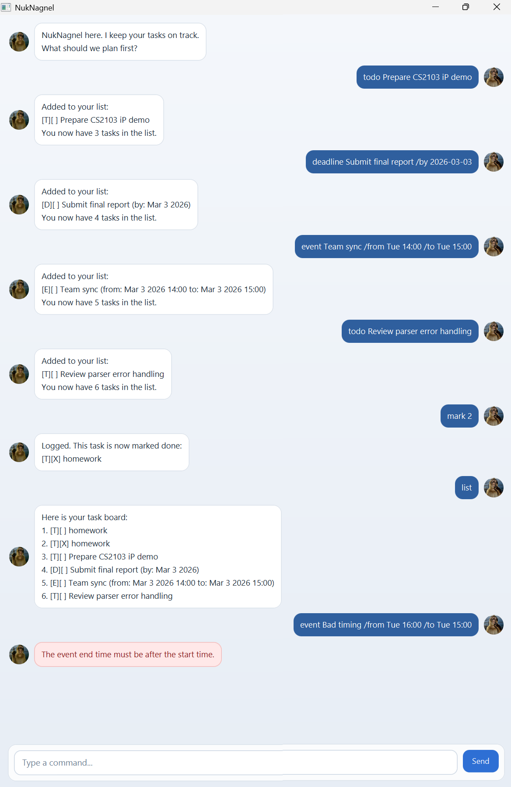

# NukNagnel User Guide

NukNagnel is a desktop task chatbot for fast task tracking through typed
commands.

## Quick Start

1. Ensure Java `17` is installed.
1. Build the app JAR:
   - `./gradlew shadowJar`
1. Run the JAR:
   - `java -jar build/libs/nuknagnel.jar`
1. Type commands in the input box and press Enter.

## Command Format Notes

- Command words are lowercase: `todo`, `deadline`, `event`, etc.
- Task indexes are 1-based in user commands.
- Leading/trailing spaces are allowed.
- `deadline` must contain exactly one `/by`.
- `event` must contain exactly one `/from` and one `/to`.
- Duplicate tasks are rejected.

## Features

### List Tasks: `list`

Shows all tasks in the current task board.

Example:
- `list`

### Add Todo: `todo`

Adds a todo task with a description.

Format:
- `todo <description>`

Example:
- `todo read chapter 5`

### Add Deadline: `deadline`

Adds a deadline task.

Format:
- `deadline <description> /by <date>`

Examples:
- `deadline submit report /by 2026-03-01`
- `deadline submit report /by Mon`

### Add Event: `event`

Adds an event task with start and end date-time.

Format:
- `event <description> /from <start> /to <end>`

Examples:
- `event team sync /from 2026-03-01 1400 /to 2026-03-01 1500`
- `event team sync /from Tue 14:00 /to Tue 15:00`

### Mark Task Done: `mark`

Marks a task as done.

Format:
- `mark <index>`

Example:
- `mark 2`

### Unmark Task: `unmark`

Marks a task as not done.

Format:
- `unmark <index>`

Example:
- `unmark 2`

### Delete Task: `delete`

Removes a task from the task board.

Format:
- `delete <index>`

Example:
- `delete 3`

### Exit App: `bye`

Closes the session.

Example:
- `bye`

## Supported Date/Time Inputs

### Dates (for `deadline /by`)

- ISO date: `yyyy-mm-dd`
- Natural weekday: `Mon`, `Monday`, `Tue`, etc.
  - Interpreted as the next occurrence of that weekday.

### Date-times (for `event /from` and `/to`)

- ISO date-time: `yyyy-mm-ddTHH:mm`
- Space-separated:
  - `yyyy-mm-dd HHmm`
  - `yyyy-mm-dd HH:mm`
- Natural weekday date-time:
  - `Mon` (defaults to `00:00`)
  - `Mon 1400`
  - `Mon 14:00`

## Data Storage

- Tasks are auto-saved to `data/nuknagnel.txt`.
- If the file is missing, NukNagnel starts with an empty list.
- Corrupted lines in the data file are skipped instead of crashing the app.

## Common Errors and How to Fix

- `I need a task number for that command.`
  - Provide an index, e.g. `mark 1`.
- `That task number doesn't exist. Try \`list\` to check.`
  - Use `list` to find valid indexes.
- `Use \`deadline <description> /by <date>\`.`
  - Include `/by` and a valid date.
- `Use one \`/from\` and one \`/to\` in an event command.`
  - Remove duplicate markers.
- `The event end time must be after the start time.`
  - Ensure `/to` is later than `/from`.
- `That task is already on your board. No duplicate added.`
  - Edit task details before adding.
